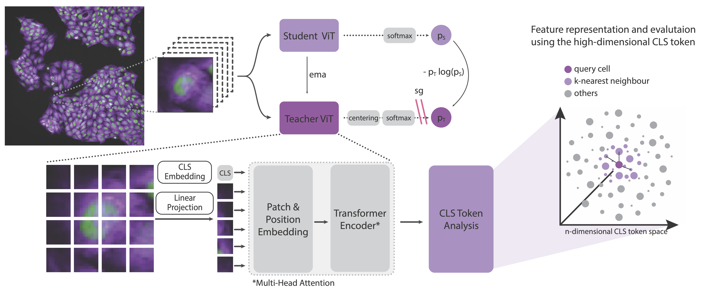
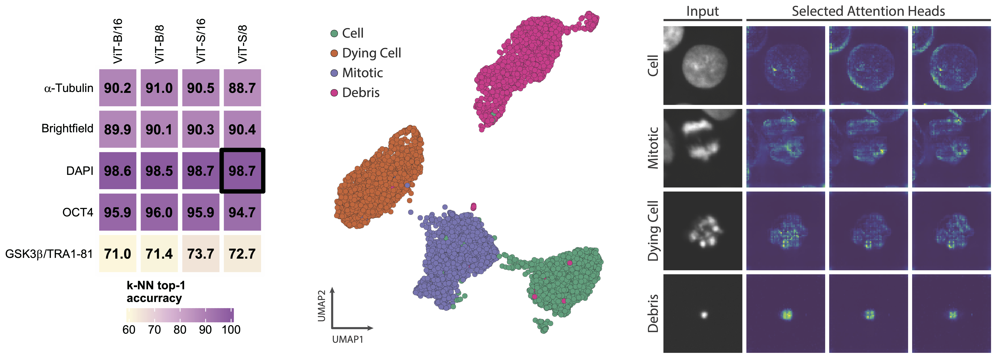
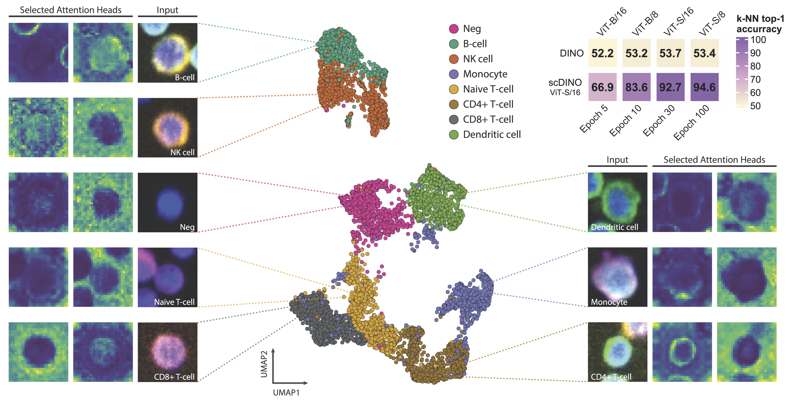

# Self-Supervised Vision Transformers for multi-channel single-cells images

Application of DINO for automated microscopy-derived fluorescent imaging datasets of single cells and instructions on how to run subsequent downstream analyses with trained Vision Transformers (ViTs) of non-RGB multi-channel images. See **Emerging Properties in Self-Supervised Vision Transformers** for the original DINO implementation and **Self-supervised vision transformers accurately decode cellular state heterogeneity** for the adaption described here.
[[`DINO arXiv`](https://arxiv.org/abs/2104.14294)] [[`scDINO bioRxiv`](https://www.biorxiv.org/content/10.1101/2023.01.16.524226v1)]

<div align="center">
  
</div>

<br>

Check out our recent publication, **Cellular Architecture Shapes the Naïve T Cell Response**, in Science Magazine. We used scDINO to identify distinct T cell phenotypes by examining over 30,000 single-cell crops of CD4 and CD8 T cells from healthy donors. We trained ViT-S/16 models exclusively on CD3 single-channel images, and downstream analysis to investigate the phenotypic heterogeneity was performed by clustering the CLS-Token latent space and visualizing it with the TopOMetry framework [[`Science`](https://www.science.org/doi/10.1126/science.adh8967)].

Further demonstration of the usefulness of the DINO framework for image-based biological discovery is presented in the preprint, **Unbiased single-cell morphology with self-supervised vision transformers**. This work demonstrates that self-supervised vision transformers can encode cellular morphology at various scales, from subcellular to multicellular [[`bioRxiv`](https://www.biorxiv.org/content/10.1101/2023.06.16.545359v1)].

## This codebase provides:

- Workflow to run analyses of multi-channel image datasets (non-RGB) with publicly available self-supervised Vision Transformers (DINO-ss-ViTs) from [[`DINO arXiv`](https://arxiv.org/abs/2104.14294)] and with scDINO (scDINO-ss-ViTs) introduced in our paper [[`scDINO bioRxiv`](https://www.biorxiv.org/content/10.1101/2023.01.16.524226v1)]
- Workflow to train ViTs on multi-channel single-cell images generated by automated microscopy using scDINO and subsequently run downstream analyses

## Pretrained models

### Public available ss-ViTs pretrained on Imagenet with DINO

This table is adapted from the [official DINO repository](https://github.com/facebookresearch/dino). You can choose to download the weights of the pretrained backbone used for downstream tasks, or the full checkpoint containing backbone and projection head weights for both student and teacher networks. Detailed arguments and training/evaluation logs are provided. Note that `DeiT-S` and `ViT-S` names refer exactly to the same architecture.

<table>
  <tr>
    <th>arch</th>
    <th colspan="6">download</th>
  </tr>
  <tr>
    <td>DINO-ss-ViT-S/16</td>
    <td><a href="https://dl.fbaipublicfiles.com/dino/dino_deitsmall16_pretrain/dino_deitsmall16_pretrain.pth">backbone only</a></td>
    <td><a href="https://dl.fbaipublicfiles.com/dino/dino_deitsmall16_pretrain/dino_deitsmall16_pretrain_full_checkpoint.pth">full ckpt</a></td>
    <td><a href="https://dl.fbaipublicfiles.com/dino/dino_deitsmall16_pretrain/args.txt">args</a></td>
    <td><a href="https://dl.fbaipublicfiles.com/dino/dino_deitsmall16_pretrain/dino_deitsmall16_pretrain_log.txt">logs</a></td>
  </tr>
  <tr>
    <td>DINO-ss-ViT-S/8</td>
    <td><a href="https://dl.fbaipublicfiles.com/dino/dino_deitsmall8_pretrain/dino_deitsmall8_pretrain.pth">backbone only</a></td>
    <td><a href="https://dl.fbaipublicfiles.com/dino/dino_deitsmall8_pretrain/dino_deitsmall8_pretrain_full_checkpoint.pth">full ckpt</a></td>
    <td><a href="https://dl.fbaipublicfiles.com/dino/dino_deitsmall8_pretrain/args.txt">args</a></td>
    <td><a href="https://dl.fbaipublicfiles.com/dino/dino_deitsmall8_pretrain/dino_deitsmall8_pretrain_log.txt">logs</a></td>
  </tr>
  <tr>
    <td>DINO-ss-ViT-B/16</td>
    <td><a href="https://dl.fbaipublicfiles.com/dino/dino_vitbase16_pretrain/dino_vitbase16_pretrain.pth">backbone only</a></td>
    <td><a href="https://dl.fbaipublicfiles.com/dino/dino_vitbase16_pretrain/dino_vitbase16_pretrain_full_checkpoint.pth">full ckpt</a></td>
    <td><a href="https://dl.fbaipublicfiles.com/dino/dino_vitbase16_pretrain/args.txt">args</a></td>
    <td><a href="https://dl.fbaipublicfiles.com/dino/dino_vitbase16_pretrain/dino_vitbase16_pretrain_log.txt">logs</a></td>
  </tr>
  <tr>
    <td>DINO-ss-ViT-B/8</td>
    <td><a href="https://dl.fbaipublicfiles.com/dino/dino_vitbase8_pretrain/dino_vitbase8_pretrain.pth">backbone only</a></td>
    <td><a href="https://dl.fbaipublicfiles.com/dino/dino_vitbase8_pretrain/dino_vitbase8_pretrain_full_checkpoint.pth">full ckpt</a></td>
    <td><a href="https://dl.fbaipublicfiles.com/dino/dino_vitbase8_pretrain/args.txt">args</a></td>
    <td><a href="https://dl.fbaipublicfiles.com/dino/dino_vitbase8_pretrain/dino_vitbase8_pretrain_log.txt">logs</a></td>

  </tr>
</table>

### scDINO ss-ViTs pretrained on high-content imaging data of single immune cells

Here you can donwload the pretrained single-cell DINO (scDINO) ss-ViTs used in our article [[`scDINO bioRxiv`](https://www.biorxiv.org/content/10.1101/2023.01.16.524226v1)]. The ViTs are pretrained on the [Deep phenotyping PBMC Image Set of Y.Severin](https://www.research-collection.ethz.ch/handle/20.500.11850/343106), a high-content imaging dataset containing labeled single-cell images of 8 different immune cell classes from multiple healthy donors. Here we provide the scDINO-ss-ViT-S/16 full checkpoint trained for 100 epochs.

<table>
  <tr>
    <th>arch</th>
    <th colspan="6">download</th>
  </tr>
  <tr>
    <td>scDINO-ss-ViT-S/16</td>
    <td><a href="https://www.research-collection.ethz.ch/handle/20.500.11850/582208">full ckpt</a></td>
     <td><a href=.github/scDINO_args.txt>args</a></td>
    <td><a href=.github/scDINO_log.txt>logs</a></td>
  </tr>
</table>

## Requirements

This codebase has been developed on a linux machine with python version 3.8, snakemake 7.20.0, torch 1.8.1, torchvision 0.9.1 and a HPC cluster running with the slurm workload manager. All required python packages and corresponding version for this setup can be found in the [requirements.txt](requirements.txt) file.

## Analyse non-RGB multi-channel images with pretrained ViTs

In Figure 1 of our manuscript we show [[`scDINO bioRxiv`](https://www.biorxiv.org/content/10.1101/2023.01.16.524226v1)] how DINO-ss-ViTs can be applied to decipher stem cell heterogeneity using single-cell images derived from high-content imaging. These single-cell images images are not RGB-based, but composed of several separate microscopy-derived greyscale images that were combined in one multi-channel TIFF image. To be able to use these multi-channel input images in combination with ViTs, we load the values of a TIFF input file as a multidimensional pytorch tensor in the **Multichannel_dataset(datasets.ImageFolder) Class** in the [compute_CLS_features.py](pyscripts/compute_CLS_features.py) which is used to construct the pytorch dataset object.

<div align="center">
  
</div>

### Run all 3 analyses at once

To send a job to the slurm cluster to compute the CLS Token representations, visualise their embeddings using UMAP and generate example attention images all at once, use the _only_downstream_snakefile_ snakemake file and the [only_downstream_snakefile.yml](configs/only_downstream_analyses.yaml) configuration file.

Example submission:

```
snakemake -s only_downstream_snakefile all \
--configfile="configs/only_downstream_analyses.yaml" \
--keep-incomplete \
--drop-metadata \
--keep-going \
--cores 8 \
--jobs 40 \
-k \
--cluster "sbatch --time=01:00:00 \
--gpus=1 \
-n 8 \
--mem-per-cpu=9000 \
--output=slurm_output_evaluate.txt \
--error=slurm_error_evaluate.txt" \
--latency-wait 45 \
```

**All configurations and parameters** (metadata and hyperparameters) of the job can be set in the [only_downstream_snakefile.yml](configs/only_downstream_analyses.yaml) file. The results will be saved in the `output_dir` folder.
Instead of running all 3 analyses at once, you can also run them separately, by specifying the target rule in the snakemake command.

#### Compute [CLS] Token representations

The representation of an image is given by the output of the [CLS] Token in form of a numeric vector with dimensionality d = 384 for ViT-S and d = 768 for ViT-B.
To compute a [CLS] feature space for a given dataset, prepare the configuration variables in the _downstream_analyses:_ subsection in [only_downstream_snakefile.yaml](configs/only_downstream_analyses.yaml).

To learn more about the args in the configuration file for the computation of the features, run:

```
pyscripts/compute_CLS_features.py --help
```

### Visualise CLS token space using UMAP

To get a glimpse of the feature space, we can use the UMAP algorithm to project multidimensional vectors into a 2D embedding. The UMAP parameters can be adjusted in the _downstream_analyses:_ _umap_eval:_ subsection of the config file.

### Run k-NN evaluation

To quantitatively evaluate label-specific clustering, we can run a k-NN evaluation to get a global clustering score across classes. The kNN parameters can be adjusted in the configuration file in the _downstream_analyses:_ _kNN:_ subsection.

### Visualisation of the CLS Token-based Self-Attention Mechanism of ss-ViTs

<div align="center">
  
</div>

To visualise the CLS token-based self-attention of the ss-ViTs, attention maps can be generated for each image class.
Our default settings randomly pick 1 image per image class in the given dataset. The attention maps are saved in the **attention_maps** subfolder of the _output_dir_ in the results folder. Each attention head is saved as a separate image. Additionally, for each original multi-channel input image, all channels are separately saved as a single image.

## scDINO training and evaluation on greyscale multi-channel images

<div align="center">
  
</div>

To train your own Vision Transformers on a given dataset from scratch and subsequently evaluate them on downstream tasks (with automatic train and test split), use the [full_pipeline_snakefile](full_pipeline_snakefile) and the [scDINO_full_pipeline_snakefile.yml](configs/scDINO_full_pipeline.yaml) configuration file.

Example submission:

```
snakemake -s full_pipeline_snakefile all \
--configfile="configs/scDINO_full_pipeline.yaml" \
--keep-incomplete \
--drop-metadata \
--cores 8 \
--jobs 40 \
-k \
--cluster "sbatch --time=04:00:00 \
--gpus=2 \
-n 8 \
--mem-per-cpu=9000 \
--output=slurm_output.txt \
--error=slurm_error.txt" \
--latency-wait 45 \
```

To reproduce the _scDINO-ss-ViT-S/16_ used in our manuscript, download the [Deep phenotyping PBMC Image Set of Y.Severin](https://www.research-collection.ethz.ch/handle/20.500.11850/343106) and define the path to the dataset in the config file under _dataset_dir_.

## License

This repository adheres to the Apache 2.0 license. You can find more information on this in the [LICENSE](LICENSE.md) file.

## Citation

If you find this adaption useful for your research, please consider citing us:

```
@article {Pfaendler2023.01.16.524226,
	author = {Pfaendler, Ramon and Hanimann, Jacob and Lee, Sohyon and Snijder, Berend},
	title = {Self-supervised vision transformers accurately decode cellular state heterogeneity},
	year = {2023},
	doi = {10.1101/2023.01.16.524226},
	URL = {https://www.biorxiv.org/content/early/2023/01/18/2023.01.16.524226},
	eprint = {https://www.biorxiv.org/content/early/2023/01/18/2023.01.16.524226.full.pdf},
	journal = {bioRxiv}
}
```
